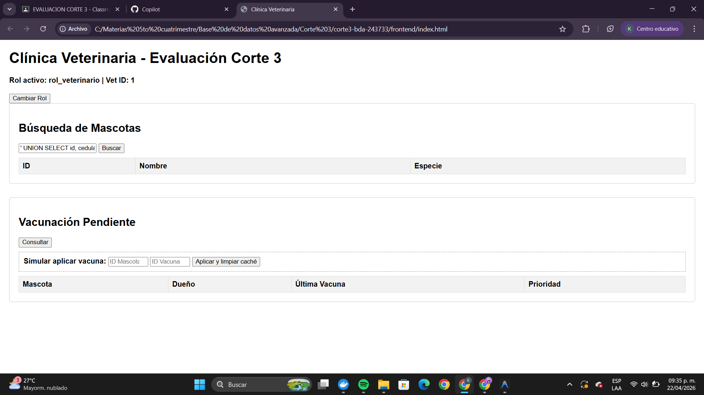
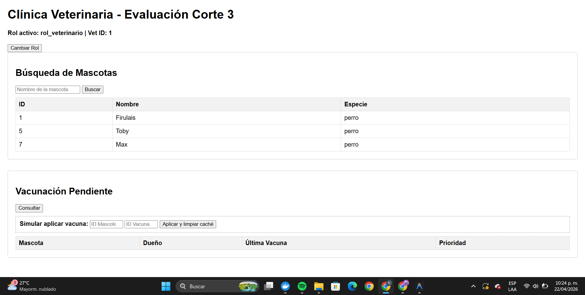

# Cuaderno de Ataques — corte3-bda-243733

## Sección 1: Tres ataques de SQL Injection que fallan

### Ataque 1: Quote-escape clásico
- **Input probado:** `' OR '1'='1`
- **Pantalla:** Campo de búsqueda de mascotas
- **Resultado:**
  ```json
  []
  ```
  *(La interfaz muestra una tabla vacía, sin errores internos de BD expuestos)*
  
  
- **Líneas que defendieron:** `api/index.js` líneas 58 y 60. La línea 58 define la consulta con `$1` y la línea 60 envía el valor separado (`await queryWithRLS(req, query, [`%${nombre || ''}%`]);`).

### Ataque 2: Stacked query
- **Input probado:** `'; DROP TABLE mascotas; --`
- **Pantalla:** Campo de búsqueda de mascotas
- **Resultado:**
  ```json
  []
  ```
  *(Ninguna tabla fue borrada)*
  
  
- **Líneas que defendieron:** `api/index.js` líneas 58 y 60. La parametrización impide que el `;` inicie un nuevo comando.

### Ataque 3: Union-based
- **Input probado:** `' UNION SELECT id, cedula, nombre, NULL FROM veterinarios --`
- **Pantalla:** Campo de búsqueda de mascotas
- **Resultado:**
  ```json
  []
  ```
  *(La consulta no ejecuta el UNION)*
  
  
- **Líneas que defendieron:** `api/index.js` líneas 58 y 60. El UNION es tratado como texto dentro del LIKE.

## Sección 2: RLS en acción

**Veterinario 1 (Dr. López, id=1)**
```json
// GET /api/mascotas
[
  { "id": 1, "nombre": "Firulais", "especie": "Perro" },
  { "id": 2, "nombre": "Toby", "especie": "Perro" },
  { "id": 4, "nombre": "Max", "especie": "Perro" }
]
```



**Veterinario 2 (Dra. García, id=2)**
```json
// GET /api/mascotas
[
  { "id": 3, "nombre": "Misifú", "especie": "Gato" },
  { "id": 5, "nombre": "Luna", "especie": "Gato" },
  { "id": 6, "nombre": "Dante", "especie": "Perro" }
]
```


**Política que produce este comportamiento:** `CREATE POLICY pol_vet_mascotas ON mascotas FOR SELECT TO rol_veterinario USING (id IN (SELECT mascota_id FROM vet_atiende_mascota WHERE vet_id = current_setting('app.vet_id')::INT));`

## Sección 3: Caché Redis funcionando

**Logs del backend (docker logs clinica_vet_api):**
```text
api-1  | 2026-04-23T10:15:22.105Z [CACHE MISS] vacunacion_pendiente_vet_1 — consultando BD (185ms)
api-1  | 2026-04-23T10:15:25.432Z [CACHE HIT] vacunacion_pendiente_vet_1 (12ms)
api-1  | 2026-04-23T10:18:40.001Z [CACHE INVALIDADO] vacunacion_pendiente* — nueva vacuna aplicada
api-1  | 2026-04-23T10:18:45.882Z [CACHE MISS] vacunacion_pendiente_vet_1 — consultando BD (210ms)
```
- **Key usada:** `vacunacion_pendiente_vet_{id}` o `vacunacion_pendiente_{rol}`
- **TTL:** 300 segundos
- **Estrategia de invalidación:** delete explícito de las llaves (`await redisClient.del(keys)`) en `POST /api/vacunas`
